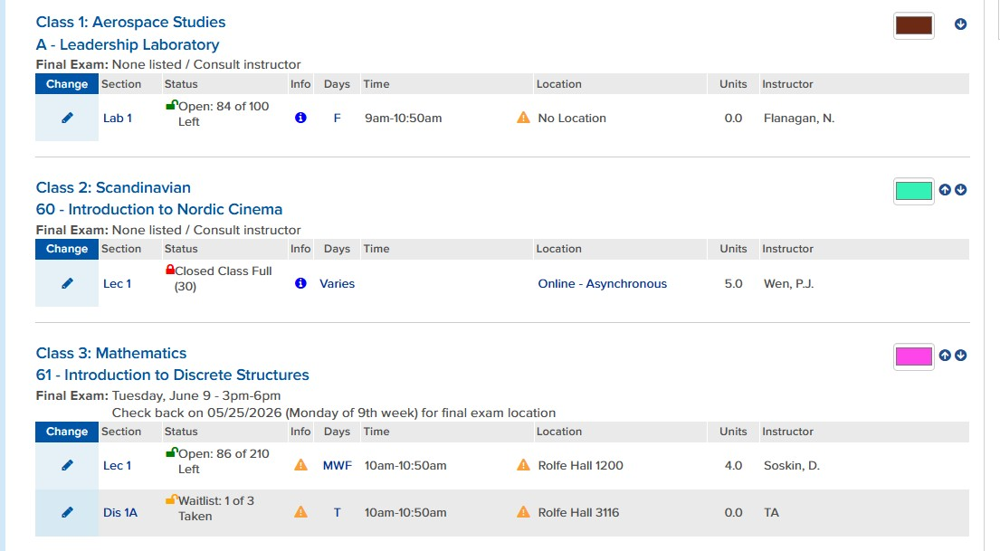
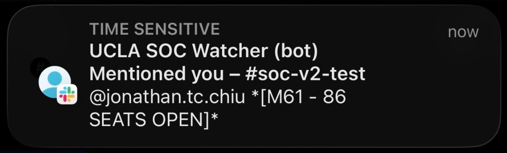

# UCLA Enrollment Monitor

Refreshes the MyUCLA Class Plan page every ~15 seconds and posts availability for monitored courses to Slack (with ping for available classes only).

## Screenshots

| UCLA Class Plan | Slack notification | Terminal output |
|-----------------|--------------------|-----------------|
|  |  |  |

## Prerequisites

- Chrome browser (or install ChromeDriver for your Chrome version)
- Slack bot token, user ID, and channel (see [slack-notifier](slack-notifier/README.md))
- `.env` in `slack-notifier/` with `SLACK_BOT_TOKEN`, `SLACK_USER_ID`, and `SLACK_CHANNEL`

## Install

From the repo root:

```bash
pip install -e slack-notifier
cd ucla-monitor
pip install -r requirements.txt
```

## Run

```bash
cd ucla-monitor
python monitor.py
```

1. Chrome opens to the UCLA enrollment page
2. Log in manually (2FA, etc.)
3. When the enrollment page is visible, press **Enter** in the terminal
4. Script refreshes every 15 seconds and posts availability to the channel (with ping)
5. Press **Ctrl+C** to stop

## Config (env vars)

| Variable | Default | Description |
|----------|---------|-------------|
| `UCLA_MONITOR_INTERVAL` | 15 | Seconds between refreshes |
| `SLACK_CHANNEL` | (required) | Channel to post to (e.g. #soc-v2-test) |

Courses are defined in `ucla-monitor/monitor.py` (`COURSES` list) by class code: `("AERO", "A")`, `("SCAND60", "60")`, `("M61", "61")`. Add `(label, class_code)` for each course to monitor.
